# 数据库管理工作台 / DatabaseManager WorkSpace

跨平台数据库管理应用（Android + JVM/Desktop）/ A cross-platform database manager (Android + JVM/Desktop).

## 功能概览 / Features

- 连接并管理 `MySQL` / `PostgreSQL` / `Redis` / Connect and manage `MySQL` / `PostgreSQL` / `Redis`.
- 查看数据库列表与可用表/逻辑库 / Browse databases and available tables/keyspaces.
- 执行查询：支持 SQL / Redis 命令，展示查询结果 / Execute queries: run SQL/Redis commands and display results.
- 图表：把查询结果可视化，并支持编辑/增删 / Charts: visualize query results and support editing/adding/removing.
- 更多：主题色/界面规范、语言设置、AI 配置、应用信息等 / More: theme/UI rules, language settings, AI configuration, and app info.

## 截图（移动端）/ Mobile Screenshots

1. 数据库列表 / Database List  
   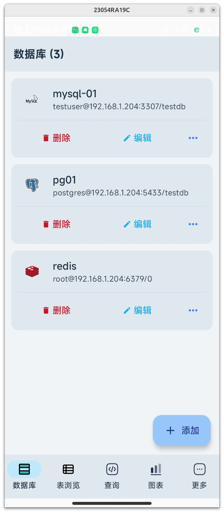  
   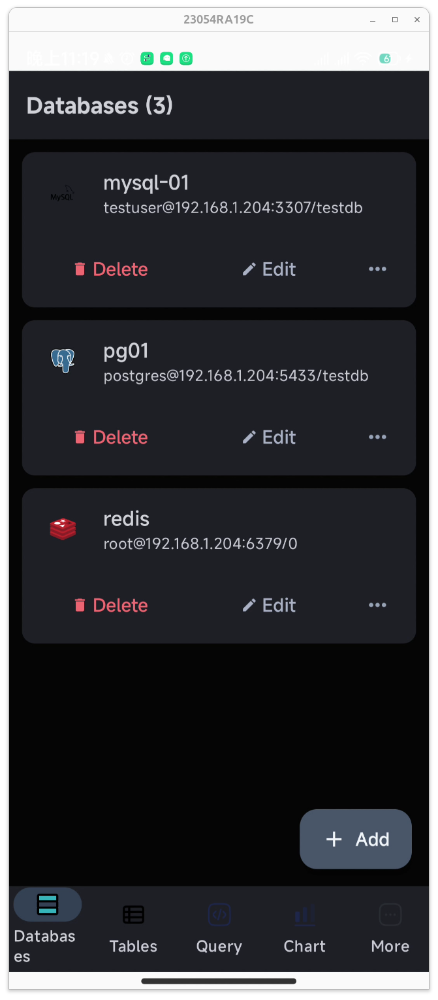

2. 表/数据选择 / Table/Data Selection  
   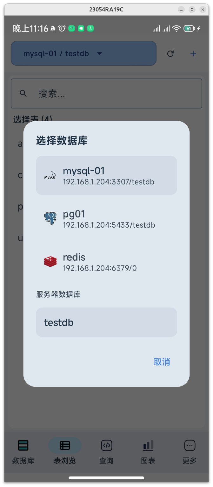  
   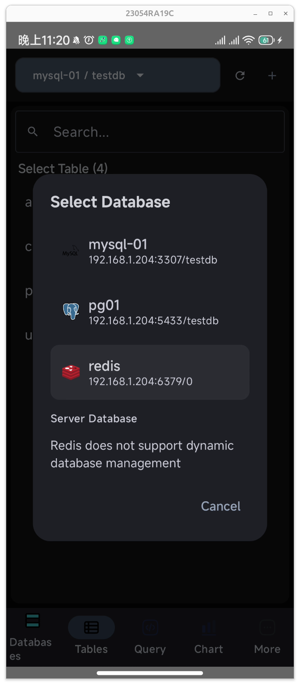

3. 查询与结果 / Query & Results  
   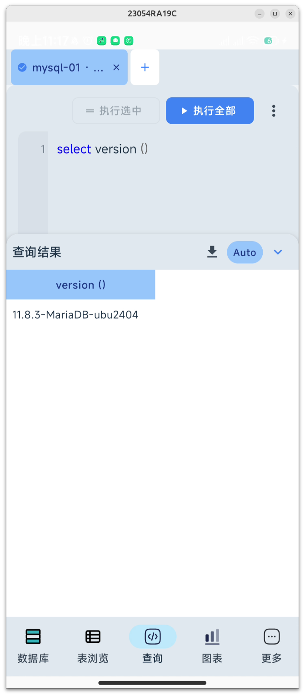  
   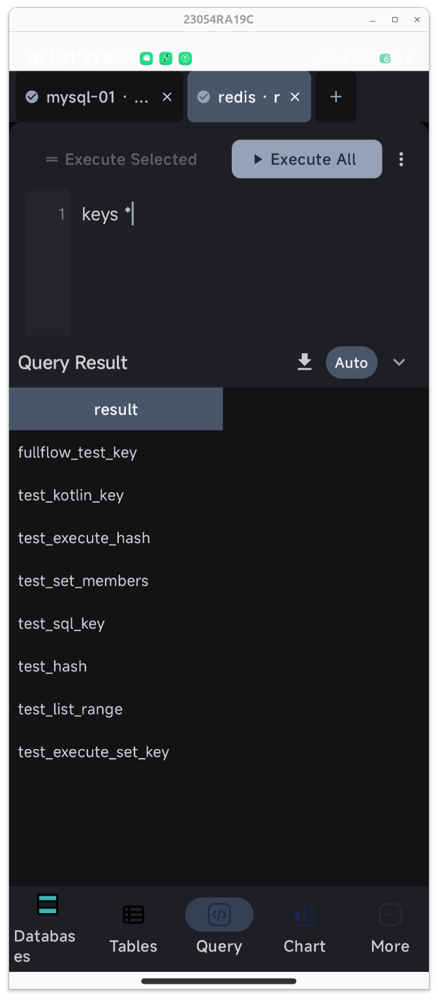

4. 图表可视化 / Chart Visualization  
   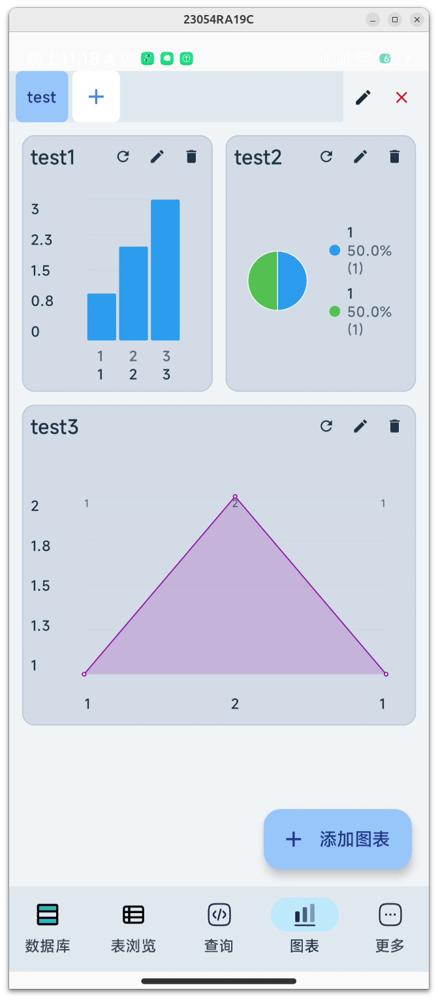  
   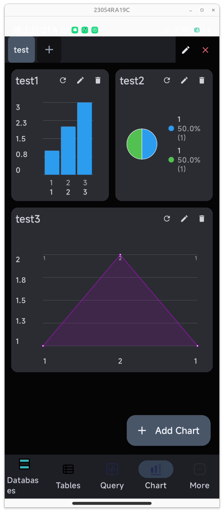

5. 设置与更多 / Settings & More  
   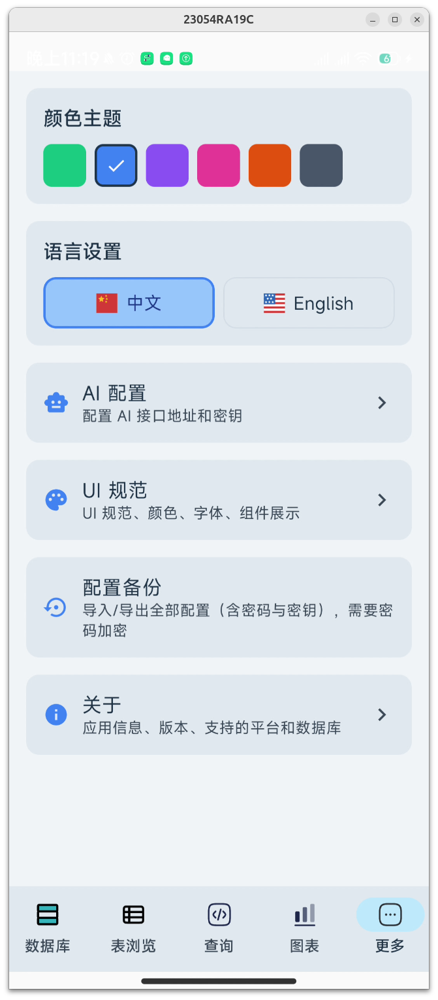  
   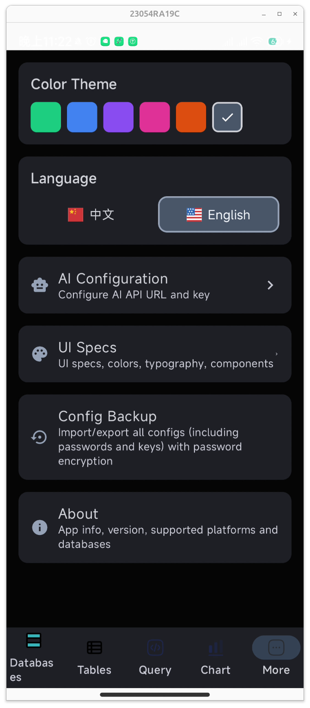

## 技术栈 / Tech Stack

- Kotlin `2.1.0` / Kotlin `2.1.0`
- Compose Multiplatform `1.7.0` / Compose Multiplatform `1.7.0`
- Gradle `8.9` / Gradle `8.9`
- 版本：`1.3.0` / Version: `1.3.0`
- 运行要求：JDK `17+`（项目中使用 `JavaVersion.VERSION_17`）/ Runtime: JDK `17+` (uses `JavaVersion.VERSION_17`).

## 快速开始（构建/运行）/ Quick Start (Build/Run)

```bash
./gradlew :app:run            # 运行 JVM 桌面应用 / Run JVM desktop app
./gradlew :app:assembleDebug # 构建 Android Debug / Build Android Debug
./gradlew :app:packageDev    # 构建 Desktop 应用 / Package Desktop app
```

## 一句话 / One-Liner

这是一个基于 Kotlin Multiplatform + Compose 的跨平台数据库管理应用，支持 MySQL、PostgreSQL 和 Redis，提供数据库浏览、查询执行和图表可视化 / This is a cross-platform database manager built with Kotlin Multiplatform + Compose, supporting MySQL, PostgreSQL, and Redis with browsing, query execution, and chart visualization.

---

## 小猫咪出场 / Meet the Cat

这只小猫咪是我曾经养过的猫，很可爱。欢迎你也被它“治愈”一下 / This is a cat I used to have. It's so cute—hope it brings you a little joy too.

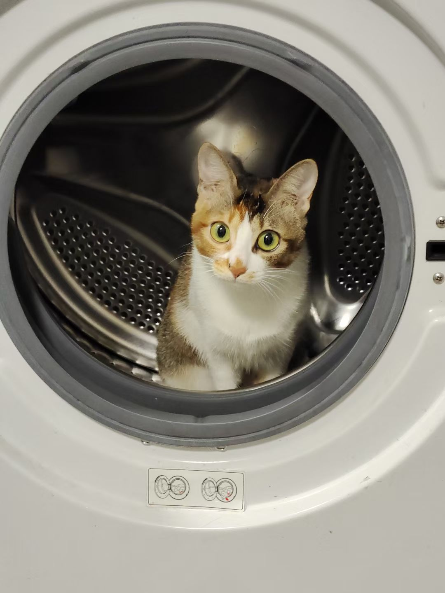

